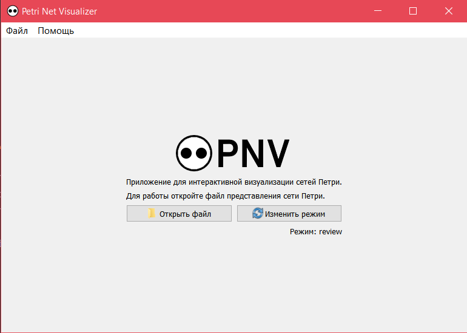
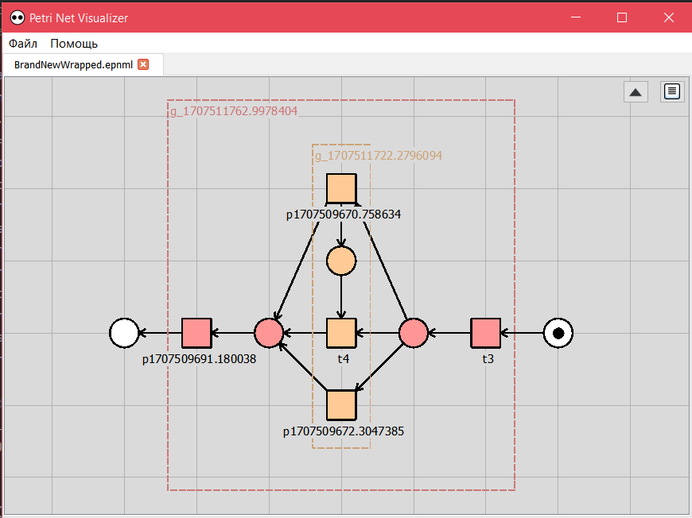
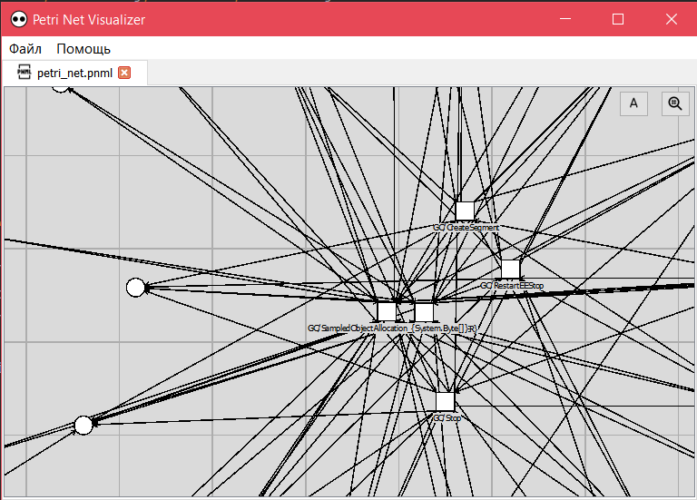
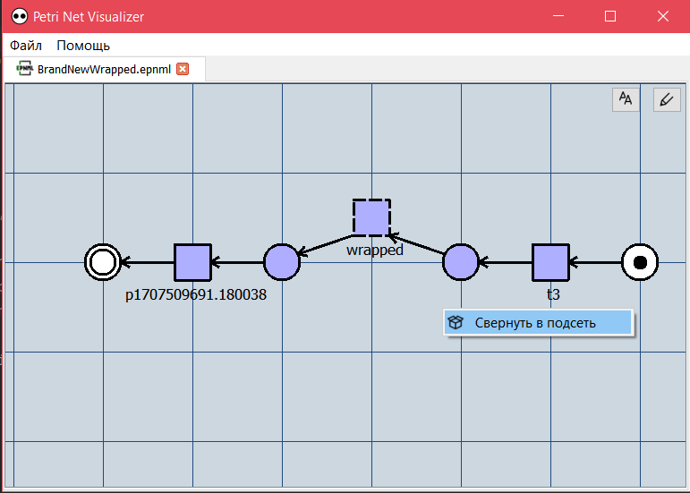

# Petri Net Visualizer v1.23
HSE SE 2nd Course Project.
Shamaev Onar Evgenevich

Continued development by jul 20.
# About program
Program written using python 3.11.
Should be able to view any *.pnml or *.epnml file.
# Program screenshots

|
# Latest interactive-features
- create/open/save any *.pnml/*.epnml file
- open multiple files
- select/deselect and move places/transitions
- file configuration available
- add/remove/connect places/transitions
# Latest ui-features
- big nets support & input-control bugfixes
- beautiful grouping by hierarchy
- new labeling modes and edit-modes available
